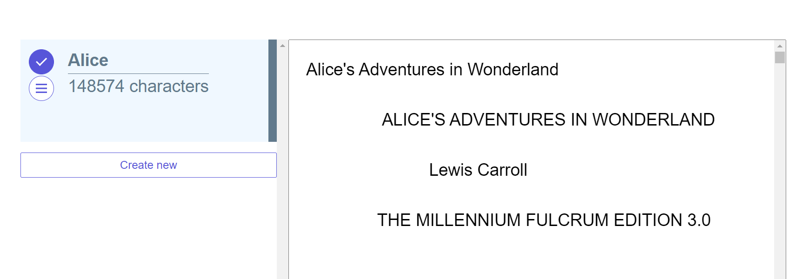
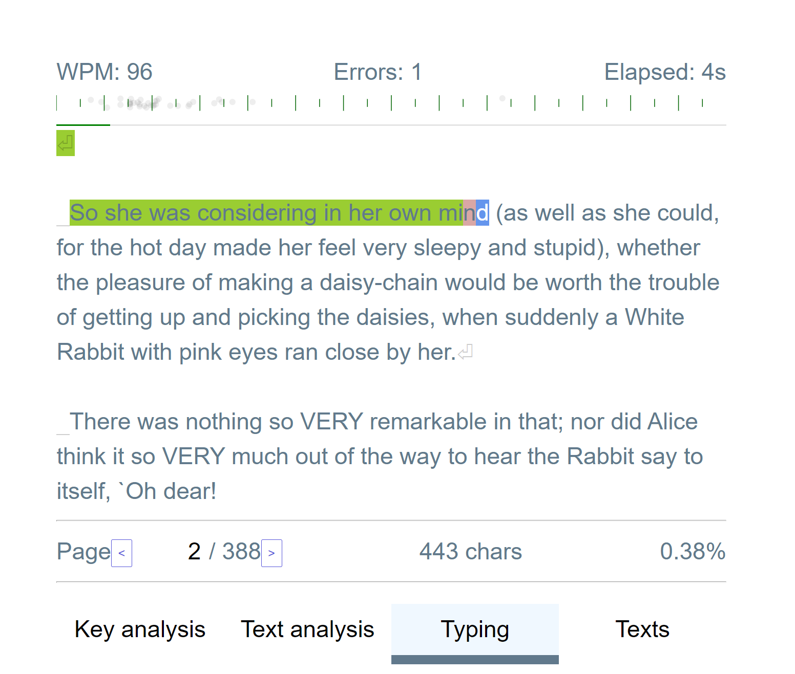
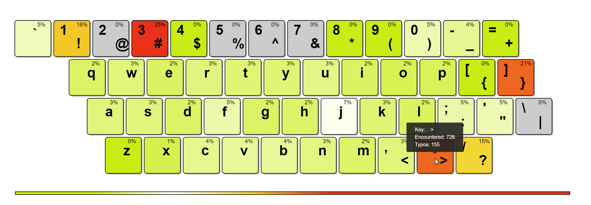
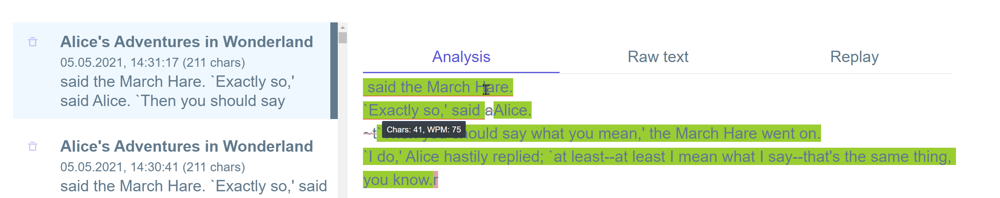

# Typist

Open source web-based typing training software. Hosted under https://amadare42.github.io/Typist/.

## Features

> Use your texts of any length to practice

You can type down any of your books, reading and practicing typing in the same time

> Analyze your mistakes using keyboard heatmap or per-text analysis

More to come...
